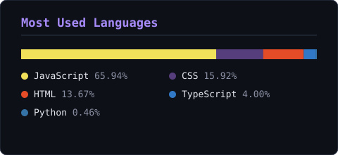
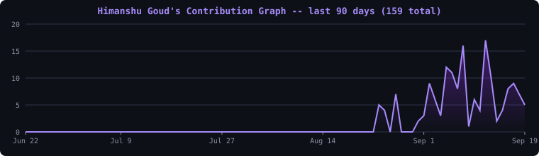

<div align="center">


[](https://git.io/typing-svg)

<p>


</p>

<p>
<!-- PORTFOLIO LINK — PLACEHOLDER: point at the himanshu-portfolio live URL once deployed -->
<a href="#"></a>
<a href="https://github.com/himanshugoud/raktsetu"></a>
<a href="https://www.linkedin.com/in/himanshu-goud-hg27"></a>
<a href="mailto:himanshugoud638@gmail.com"></a>
<a href="https://github.com/himanshugoud"></a>
</p>

<p>


</p>

</div>

<br/>

## About

I build full-stack web applications — real-time systems, geospatial matching, and authenticated multi-user dashboards — and take them from local code to production deployments I own end-to-end.

My strongest work is React front ends backed by Node.js/Express + MongoDB or Firebase, with an emphasis on testing what I ship — Vitest suites, CI gates, and Lighthouse audits — rather than shipping and hoping.

**Open to:** full-stack / SDE internship and placement opportunities.

<br/>

## `himanshu@github` ~ `$ neofetch`

<div align="center">

</div>

<br/>

## Tech Stack

**Languages**


**Frontend**


**Backend & Databases**


**Cloud, DevOps & Tooling**


<sub>Render is also part of my deployment stack (backend hosting for RaktSetu) — not shown above, skillicons.dev has no icon for it.</sub>

<br/>

## Featured Projects

<details open>
<summary><b>RaktSetu — Emergency Blood Donor Network</b></summary>
<br/>

Matches urgent blood requests to nearby compatible donors in real time, replacing slow, easy-to-miss email alerts with an on-screen, callable, ranked donor list.

| | |
|---|---|
| **Stack** | React · Vite · Tailwind CSS · Node.js · Express · MongoDB · JWT |
| **Scale** | 3-service free-tier deployment (Vercel / Render / MongoDB Atlas) |
| **Performance** | 4-tier geo-radius escalation (10km → 100km) when local matches are sparse |
| **Security** | JWT auth, token-based password reset, rate limiting, zero committed secrets |
| **Impact** | Automates donor matching end-to-end; correctness validated with 17 automated Vitest tests covering compatibility and geo-distance logic |
| **Repository** | [github.com/himanshugoud/raktsetu](https://github.com/himanshugoud/raktsetu) |

**[Live Demo](https://raktsetu-phi.vercel.app/)** · **[Source](https://github.com/himanshugoud/raktsetu)**

</details>

<details open>
<summary><b>SmartPark — Real-Time Parking Management System</b></summary>
<br/>

Live multi-floor parking availability with instant slot booking and no page reloads.

| | |
|---|---|
| **Stack** | JavaScript · HTML5 · CSS3 · Firebase Realtime Database · Firebase Auth · Firebase Hosting |
| **Scale** | Real-time sync across every connected client, multiple floors |
| **Performance** | Load-tested at 50 concurrent writes — 100% success, zero conflicts; Lighthouse 100 Accessibility, 100 Best Practices |
| **Security** | Firebase Auth (email/password + Google Sign-In), write-validated security rules; found and fixed a real session-isolation bug that leaked bookings across accounts |
| **Impact** | 45 automated Vitest tests; CI/CD gates every deploy on the full suite passing |
| **Repository** | [github.com/himanshugoud/smartpark](https://github.com/himanshugoud/smartpark) |

**[Live Demo](https://smartpark-hg.web.app/)** · **[Source](https://github.com/himanshugoud/smartpark)**

</details>

<sub>An earlier prototype of SmartPark (`smartpark-real-time-parking-management-system`) also exists on this account — vanilla JS with `localStorage` instead of Firebase, no tests. It's an older iteration of the project above, not a separate flagship.</sub>

<br/>

## Achievements

<div align="center">

| Recognition | Details |
|---|---|
| Public Relations Representative — Mood Indigo, IIT Bombay | Ranked 6th of 530 participants pan-India in digital outreach and engagement for the 55th edition (Aug – Dec 2025), Asia's largest college cultural festival |
| Core Team Member — Soft Computing Research Society | Planned and executed technical workshops for 100+ student attendees, coordinating a 20-member core committee (Sept 2025 – Present) |

</div>

<br/>

## Education

**B.Tech, Mathematics and Computing**
Madhav Institute of Technology and Science, Gwalior (MP), India — `Sept 2023 – Present`

<br/>

## Certifications

**NPTEL**

| Certificate | Score | Date |
|---|---|---|
| [Cloud Computing](https://drive.google.com/file/d/1-QCZu5jftUwa3eXb6vSCYJ6RzgqOrCSA/view?usp=drivesdk) | 82% | May 2026 |
| [Introduction to Algorithms and Analysis](https://drive.google.com/file/d/1bqfN27nmWVjTGjmzEvLcizEEWHNN4guF/view?usp=drivesdk) | 75% | Nov 2025 |

<br/>

## GitHub Analytics

<div align="center">


<br/>




</div>

<sub>Streak stats are pulled live from the GitHub API. The stats and languages cards are static SVGs regenerated once a day by a GitHub Action in this repo (`.github/workflows/update-stats.yml`) and served directly from GitHub — not from the public Vercel demo, which is unreliable.</sub>

<br/>

## GitHub Trophies

<div align="center">

</div>

<br/>

## Contribution Activity

<div align="center">

</div>

<sub>Real daily contribution counts for the last 90 days, pulled from GitHub's own public contributions page and rendered as a chart by the same GitHub Action — no external charting service involved.</sub>

<br/>

## Contribution Snake

<div align="center">

<picture>
  <source media="(prefers-color-scheme: dark)" srcset="profile/snake-dark.svg" />
  <source media="(prefers-color-scheme: light)" srcset="profile/snake.svg" />
  
</picture>

</div>

<sub>Animated from real contribution data by the official <a href="https://github.com/Platane/snk">Platane/snk</a> GitHub Action, regenerated daily alongside the cards above.</sub>

<br/>

## Current Focus

```yaml
Learning:   Advanced data structures & system design fundamentals
Building:   Refining RaktSetu and SmartPark; scoping the next full-stack project
Exploring:  Deployment patterns across Vercel, Render, and Firebase
Open to:    Full-stack / SDE internship and placement opportunities
```

<br/>

## Connect

<div align="center">

<a href="mailto:himanshugoud638@gmail.com"></a>
<a href="https://www.linkedin.com/in/himanshu-goud-hg27"></a>
<a href="https://github.com/himanshugoud"></a>
<!-- PORTFOLIO LINK — PLACEHOLDER: point at the himanshu-portfolio live URL once deployed -->
<a href="#"></a>
<!-- RESUME LINK — PLACEHOLDER: add a hosted/Drive link to Himanshu_MAC_Resume.pdf -->
<a href="#"></a>

</div>

<br/>

<div align="center">

<sub>Real projects, real tests, real deployments — no filler.</sub>


</div>
