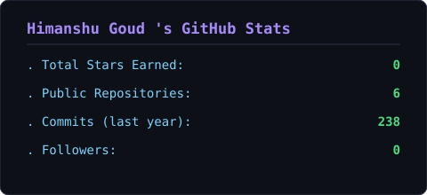
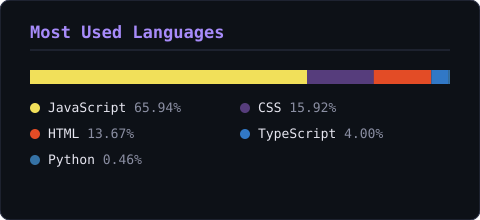
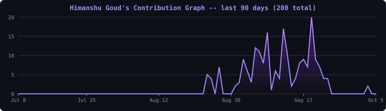
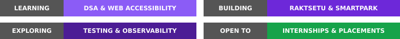

 

## 👤 𝙰𝚋𝚘𝚞𝚝

Full-stack developer who ships production-grade systems, not tutorials.

Built and deployed 2 tested, real-world applications — real-time architecture, geospatial matching, secure auth, CI-gated releases.

**Open to:** full-stack / SDE internship and placement opportunities.

 

## 💻 𝚃𝚎𝚌𝚑 𝚂𝚝𝚊𝚌𝚔

 

## 🚀 𝙵𝚎𝚊𝚝𝚞𝚛𝚎𝚍 𝙿𝚛𝚘𝚓𝚎𝚌𝚝𝚜

<b>RaktSetu — Emergency Blood Donor Network</b>

 

Matches urgent blood requests to nearby compatible donors in real time.

| | |
|---|---|
| **Stack** | React · Node.js · Express · MongoDB · JWT |
| **Real-Time Matching** | Replaced slow, easy-to-miss email alerts with real-time MongoDB geospatial matching and Web Push notifications, confirmed working end-to-end in production |
| **Testing** | 40 automated tests (Vitest, Supertest, React Testing Library) across unit, integration, and frontend layers — caught a MongoDB index race condition, which was then fixed |
| **Accessibility** | Added ARIA error announcements, fixed a keyboard-focus CSS bug, and ensured status is never conveyed by color alone |
| **Monitoring & CI** | Sentry error monitoring with PII scrubbing (emails, phone, GPS, tokens stripped before logging); GitHub Actions CI gating every push on the full test suite |

<b>SmartPark — Real-Time Parking Management System</b>

 

Live multi-floor parking availability with instant slot booking.

| | |
|---|---|
| **Stack** | JavaScript · Firebase · HTML5 · CSS3 |
| **Real-Time Sync** | Synced 300 parking slots across 3 floors in real time via Firebase Realtime Database; load-tested at 50 concurrent writes with 100% success |
| **Data Migration** | Migrated booking data to Firebase for cross-device sync; found and fixed a concurrency bug letting two users double-book the same slot |
| **Accessibility** | Raised Lighthouse Accessibility from 83 to 100 by computing real WCAG contrast ratios per UI state, across both light and dark themes |
| **CI/CD** | GitHub Actions pipeline running 45 automated tests on every push, blocking deployment whenever a test fails |

 

## 📊 𝙶𝚒𝚝𝙷𝚞𝚋 𝙰𝚗𝚊𝚕𝚢𝚝𝚒𝚌𝚜

 

<table width="100%">
<tr>
<td width="50%" align="center">

</td>
<td width="50%" align="center">

</td>
</tr>
</table>

 

## 📈 𝙲𝚘𝚗𝚝𝚛𝚒𝚋𝚞𝚝𝚒𝚘𝚗 𝙰𝚌𝚝𝚒𝚟𝚒𝚝𝚢

 

## 🐍 𝙲𝚘𝚗𝚝𝚛𝚒𝚋𝚞𝚝𝚒𝚘𝚗 𝚂𝚗𝚊𝚔𝚎

<picture>
  <source media="(prefers-color-scheme: dark)" srcset="profile/snake-dark.svg" />
  <source media="(prefers-color-scheme: light)" srcset="profile/snake.svg" />
  
</picture>

 

## 🎯 Current Focus

## 📬 𝙲𝚘𝚗𝚗𝚎𝚌𝚝

<!-- PORTFOLIO LINK — PLACEHOLDER: point at the himanshu-portfolio live URL once deployed -->

&nbsp;&nbsp;

&nbsp;&nbsp;

 

Real projects, real tests, real deployments — no filler.

